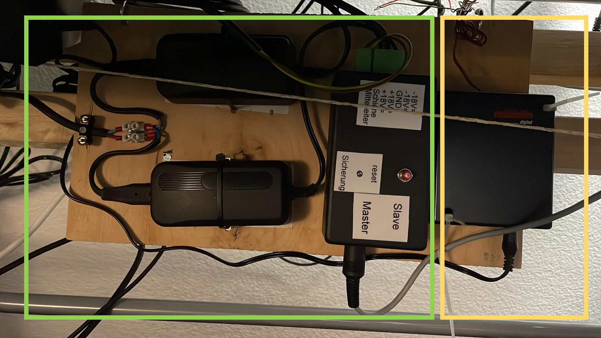
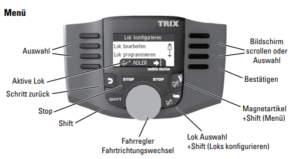
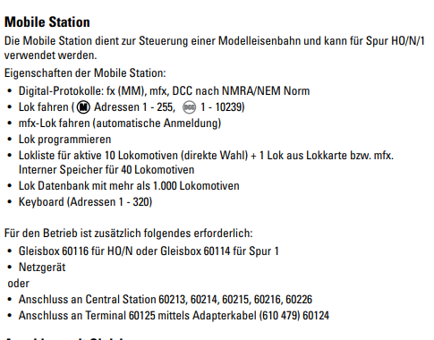
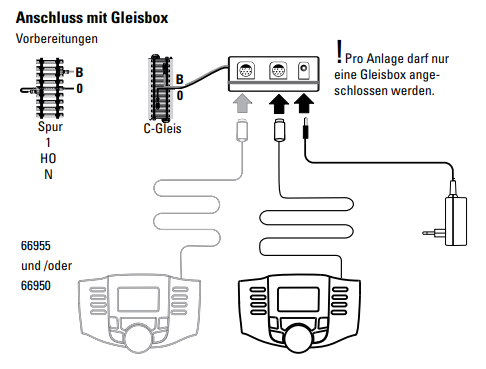

# morgenstern
HO Loksteuerung mit Raspberry

ein Projekt von Siggi und Rainer

## Labor Setup Rainer
Die elektrische Installation des Labors:   
Dazu gehört ein (C Gleis Märklin) Stück Gleis von ca 1m Länge.

## DCC
see [DCC](./dcc/README.MD)

### Elektrik
Der grüne Teil zeigt die Selbstbau Elektronik von Siggi & Kai, Digitalformat Motorola.  
Der gelbe Teil ist eine TRIX Steuerung (Mobile Station, Hersteller Nummer 66955)

#### TRIX Mobile Station 66955
- Formate: Motorola, DCC, mfx
- Mit Programmiermöglichkeit
- Siehe Dokumentation [TRIX Bedienungsanleitung](./laborSetup/Trix.mobileStation.66955.pdf)
- Ausschnitte aus der Dokumenation
  - Abbildung und Menü 
  - Funktionsumfang 
  - Anschluss 